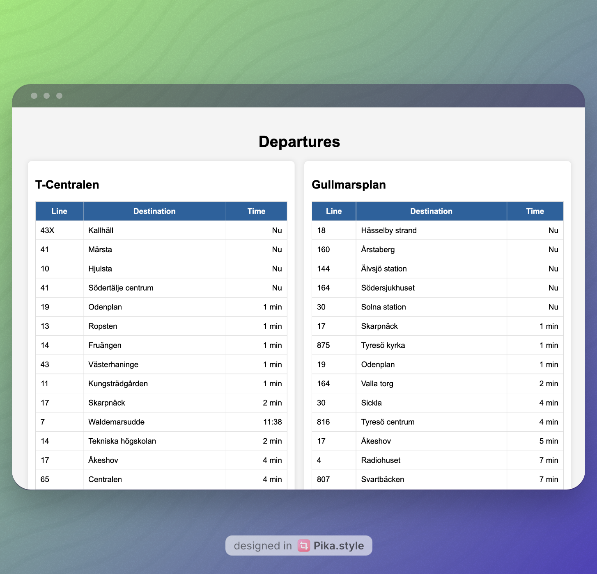

# SL Transit Departures API

A Go-based web application that displays real-time transit departures for specified Stockholm transit stations using the SL (Stockholms Lokaltrafik) API.



## Features

- Real-time departure information for specified transit stations
- Web interface displaying departures in a clean, readable format
- Configurable list of stations to monitor
- Built with Go and Gin web framework
- Uses SL's public transport API

## Prerequisites

- Go 1.16 or higher
- Git

## Installation

1. Clone the repository:
```bash
git clone <repository-url>
cd sl-api-app
```

2. Install dependencies:
```bash
go mod download
```

3. Build the application:
```bash
go build
```

## Configuration

The application uses a `sites.json` file to configure which transit stations to monitor. Edit this file to add or remove stations:

```json
{
    "sites": ["Station Name 1", "Station Name 2"]
}
```

Note: Station names must match exactly with SL's naming convention.

## Usage

1. Start the application:
```bash
./go-api-app

# OR
go run main.go
```

2. Open your web browser and navigate to:
```
http://localhost:8080
```

The web interface will display real-time departure information for all configured stations.

## API Endpoints

- `GET /`: Main web interface showing departure information for all configured stations

## Project Structure

- `main.go`: Main application code
- `sites.json`: Configuration file for transit stations
- `templates/`: HTML templates for the web interface
- `go.mod` & `go.sum`: Go module dependency files

## Dependencies

- [Gin Web Framework](https://github.com/gin-gonic/gin)
- Standard Go libraries

